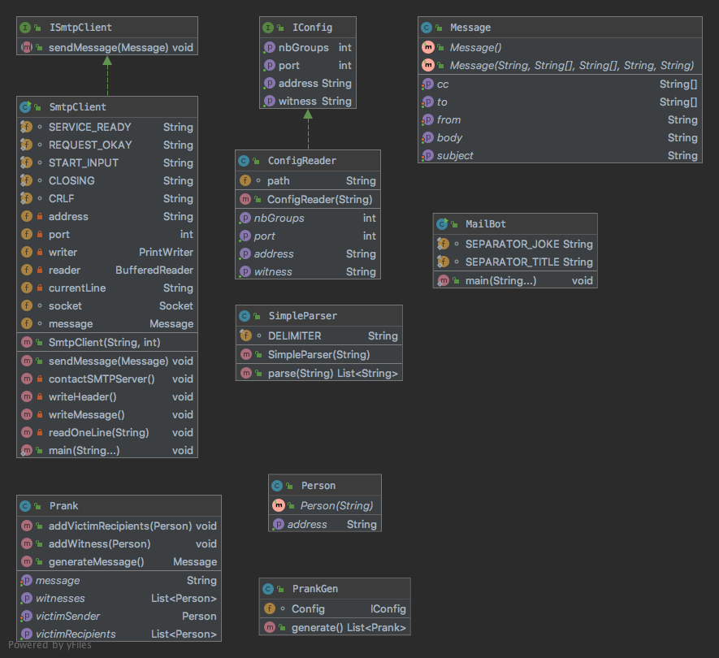
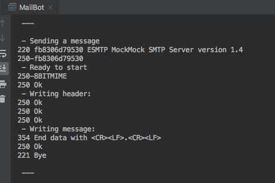

# Labo SMTP

> HEIG-VD
>
> Gabrielli Alexandre, Póvoa Tiago

## Description

Ce laboratoire permet d'envoyer des mails fictifs à un serveur MockMock. On peut configurer son comportement avec les ressources:

* config.properties
  * Définir le nombre de groupes auxquels difuser
  * Port et adresse
  * Témoin en copie carbone
* jokes.utf8
  * Les blagues à envoyer séparés par des `\n-//-\n` 
  * Le titre est séparé du corps du Mail par `\n-\-\n`
* victimes.utf8
  * Liste des victimes à qui envoyer

À Noter que le nombre de groupes (min 3 personnes) et la liste des victimes doivent être compatibles

## Guide d'installation

Au chemin suivant: 

> /install/run.sh

un petit exécutable `run.sh` est fournit. Il va build l'image docker avec le MockMock.jar à l'intérieur et mapper les ports 2525 et 8080 (et les exposer).

Puis, afin d'exécuter le code du projet

> mvn clean install

Il faudra ensuite exécuter le jar dans target 

>java -jar labo-smtp-1.0-launcher.jar

*=> Cette étape génère une erreur " Caused by: java.lang.ClassNotFoundException: heig-vd.ch.bot.MailBot "
Pas compris comment on devait lui préciser la méthode main dans le pom.xml*

## Explications

Ce server SMTP factice va permettre de faire des tests. 

Le port 2525 est celui auquel on envoie les mails.

Le port 8080 quant à lui permet de se connecter à une page web qui montre ce qui a été reçu.

## Implémentation

Diagramme uml:

Le point d'entrée est Mailbot. Il est responsable d'appeler le PrankGen pour former des Messages à envoyer. Ensuite c'est la classe SmtpClient qui sera responsable des communications avec le serveur MockMock.

L'image suivante montre un dialogue réussit.

